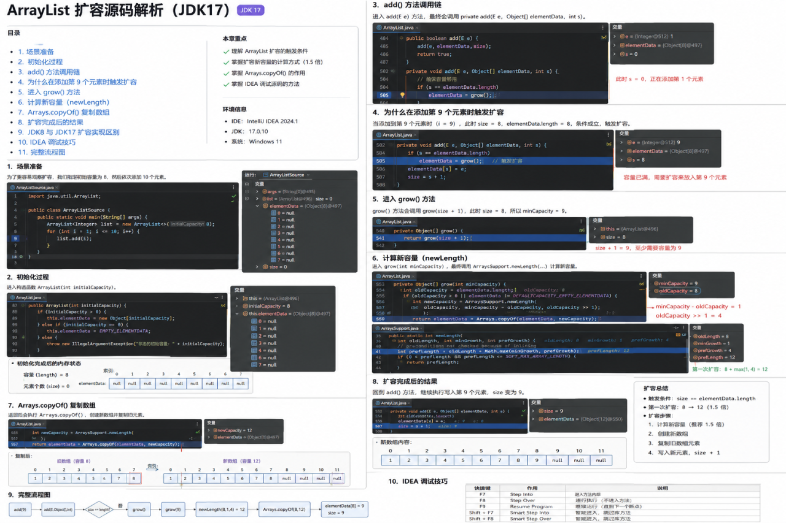

# ArrayList 扩容机制笔记（JDK 17）

配套代码：[src/com/list/ArrayListSource.java](../src/com/list/ArrayListSource.java)

## 图示总览

下面这张图是 ArrayList 扩容流程的整体截图，建议先看图里的步骤，再对照后面的文字和代码阅读。



这篇笔记配合 `ArrayListSource` 阅读。代码里有两部分：

- `useJdkArrayList()`：直接使用 JDK 的 `ArrayList`，观察正常添加元素的效果。
- `showGrowProcess()`：用一个简化版 `SimpleArrayList` 模拟扩容流程，打印每次容量变化。

## 1. ArrayList 为什么需要扩容

`ArrayList` 底层用数组保存元素。数组长度一旦创建就固定，不能在原数组上直接变长。

所以当元素数量超过当前数组容量时，`ArrayList` 会：

1. 计算新的数组容量。
2. 创建一个更大的新数组。
3. 把旧数组里的元素复制到新数组。
4. 继续把新元素放进去。

这个过程就是扩容。

## 2. 核心字段

源码中最重要的是两个概念：

```java
private Object[] elementData;
private int size;
```

- `elementData`：真正保存元素的数组。
- `size`：当前已经存了多少个元素。

注意：`size` 不是数组容量。容量要看 `elementData.length`。

## 3. add 方法如何触发扩容

添加元素时，`ArrayList` 需要先确认容量够不够。

简化理解如下：

```java
ensureCapacity(size + 1);
elementData[size++] = element;
```

其中 `size + 1` 表示“添加这个新元素之后，至少需要多少容量”。

比如当前 `size = 8`，再添加 1 个元素时，最小需要容量就是 `9`。

## 4. 第一次添加元素时的默认容量

无参构造创建的 `ArrayList` 一开始并不会马上创建长度为 10 的数组。

```java
List<Integer> list = new ArrayList<>();
```

第一次真正添加元素时，才会把容量扩到默认容量 `10`。

在 `ArrayListSource.java` 的模拟代码里，对应逻辑是：

```java
if (elementData.length == 0) {
    minCapacity = Math.max(DEFAULT_CAPACITY, minCapacity);
}
```

也就是：

- 当前数组容量是 `0`
- 第一次添加元素最少只需要 `1`
- 但是默认容量是 `10`
- 所以第一次扩容到 `10`

## 5. 什么时候会再次扩容

只有当“需要的最小容量”大于“当前数组容量”时，才会扩容。

```java
if (minCapacity > elementData.length) {
    grow(minCapacity);
}
```

例如当前容量是 `10`：

- 添加第 1 到第 10 个元素：容量够，不扩容。
- 添加第 11 个元素：最小需要容量是 `11`，当前容量是 `10`，触发扩容。

如果代码中使用 `new ArrayList<>(8)`，那么添加第 9 个元素时就会触发扩容。

## 6. 新容量如何计算

`ArrayList` 常见扩容规则是扩大为原来的 `1.5` 倍：

```java
int newCapacity = oldCapacity + (oldCapacity >> 1);
```

这里的 `oldCapacity >> 1` 可以理解成 `oldCapacity / 2`。

所以：

```text
newCapacity = oldCapacity + oldCapacity / 2
```

例子：

| 旧容量 | 计算方式 | 新容量 |
| --- | --- | --- |
| 10 | 10 + 5 | 15 |
| 15 | 15 + 7 | 22 |
| 8 | 8 + 4 | 12 |

如果按 `new ArrayList<>(8)` 创建列表，添加第 9 个元素时：

```text
oldCapacity = 8
minCapacity = 9
newCapacity = 8 + 8 / 2 = 12
```

所以容量会从 `8` 扩到 `12`。

## 7. Arrays.copyOf 的作用

扩容不是在原数组上变长，而是创建一个新数组：

```java
elementData = Arrays.copyOf(elementData, newCapacity);
```

`Arrays.copyOf` 会做两件事：

1. 创建一个长度为 `newCapacity` 的新数组。
2. 把旧数组里的元素复制到新数组。

复制完成后，`elementData` 指向新数组，旧数组等待垃圾回收。

## 8. 运行配套代码

在 IDEA 中打开并运行：

```text
src/com/list/ArrayListSource.java
```

你会看到类似输出：

```text
扩容: 0 -> 10
扩容: 10 -> 15
扩容: 15 -> 22
```

这说明简化版 `SimpleArrayList` 在添加元素时，按照默认容量和 `1.5` 倍规则进行了扩容。

## 9. 总结

`ArrayList` 扩容可以记住这几句话：

- 底层是数组，数组长度固定，所以容量不够时必须扩容。
- 无参构造第一次添加元素时，默认扩到 `10`。
- 后续常见扩容规则是 `oldCapacity + oldCapacity / 2`，也就是约 `1.5` 倍。
- 扩容时会创建新数组，并通过 `Arrays.copyOf` 复制旧元素。
- `size` 表示元素个数，`elementData.length` 才表示底层数组容量。
